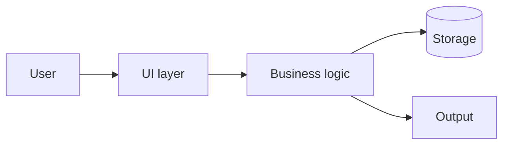

# Fin_Break — Design (Phase B)

> **Status:** Template — filled during Phase B.
> **Phase:** B — Design.
> **Output:** architecture diagram, components, data flow,
> ADRs in `docs/decisions/`.
> **Gate:** user explicitly approves this document and the
> ADRs before Phase C starts.
> **Source of truth for:** *what is*. ADRs are *why we chose
> this*; specs are *contract for one item*.

## Architecture

> *Replace the placeholder with the actual architecture.
> Mermaid renders in both Ants Terminal and GitHub.*

## Components

> *One bullet per box in the diagram. One-line summary, plus
> a "main responsibility" sentence. Every box has exactly
> one main responsibility — if a component has two, split
> it.*

- **UI layer** — (filled during Phase B). Main responsibility:
  presenting state to the user and capturing input.
- **Business logic** — (filled during Phase B). Main
  responsibility: turning user input into state changes.
- **Storage** — (filled during Phase B). Main responsibility:
  persisting state across sessions.
- **Output** — (filled during Phase B). Main responsibility:
  formatting state for delivery (file, network, screen).

## Data flow

> *Describe the dominant path through the system, plus any
> feedback loops (how user input causes UI updates). Don't
> list every code path; describe the canonical one and any
> notable side-paths.*

(filled during Phase B)

## Cross-cutting concerns

> *Things that touch multiple components. Each gets a one-
> paragraph treatment so they don't get lost in
> per-component design.*

### Error handling

(filled during Phase B — typical questions: do errors propagate
to the UI? Are they logged? Do we have a global handler? Is
there a retry policy?)

### Observability

(filled during Phase B — what's logged, what's metricised,
what's tracked, who reads them)

### State management

(filled during Phase B — single store / per-component / per-
session / persisted; what triggers state changes; how state
flows between components)

### Persistence

(filled during Phase B if Storage is non-trivial — schema,
migrations, atomic-write strategy, backup policy)

## Architecture Decision Records

ADRs for non-obvious choices live in
[docs/decisions/](decisions/) — one file per decision,
sequential numbering, never edited after acceptance.

Phase B should produce at least one ADR per non-obvious
choice. If a choice was obvious (e.g. "we picked the standard
library for collections"), no ADR. If a contributor six
months from now might propose an alternative, ADR.

Recommended starting set:

- ADR-0001: Record architecture decisions (already in template).
- ADR-0002: Choose <chosen-language> over <runner-up> for the
  business logic.
- ADR-0003: Choose <storage-mechanism> over <alternatives>.

## Sign-off

- [ ] Architecture diagram drafted (mermaid renders cleanly).
- [ ] Component list captures every box, with main
  responsibility per box.
- [ ] Data flow described.
- [ ] Cross-cutting concerns each have a one-paragraph
  treatment.
- [ ] At least one ADR per non-obvious choice written.
- [ ] **User has approved this document and the ADRs.**
  Date: ____.

Once approved, proceed to Phase C — write the four
`docs/standards/*.md` files, populate `ROADMAP.md`, and write
specs for the first 1–3 roadmap items.
